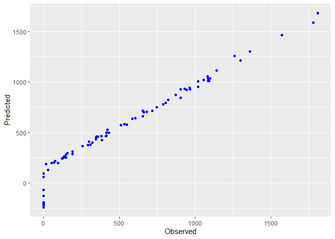
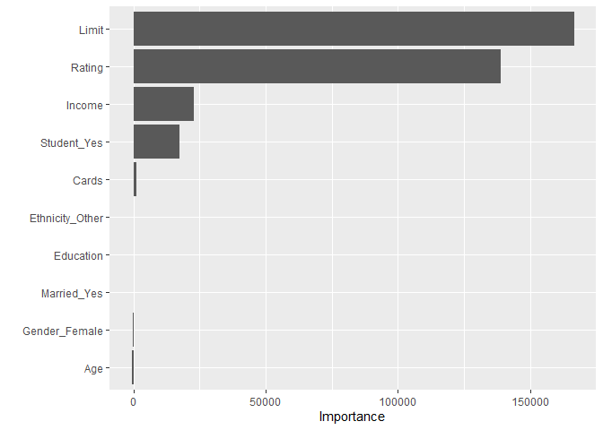
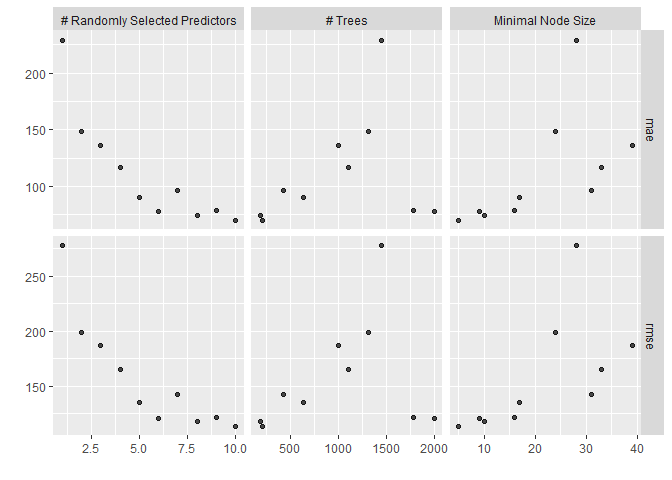

Tidymodels
================

## Intro

We will use ‘Credit’, a small dataframe from ISLR data package, since
the main goal is to explore the predict models only, not data wrangling.

Our goal is to predict the variable “Balance”. I will use the mean
squared error(MSE) as quality measure for our models.

## Packages

``` r
library(tidymodels)
library(ISLR)
library(tidyverse)
library(vip)
library(doParallel)
library(skimr)
```

## Gathering data

``` r
df <- Credit %>% as_tibble()
```

## Exploring data

``` r
skim(df)
```

|                                                  |      |
|:-------------------------------------------------|:-----|
| Name                                             | df   |
| Number of rows                                   | 400  |
| Number of columns                                | 12   |
| \_\_\_\_\_\_\_\_\_\_\_\_\_\_\_\_\_\_\_\_\_\_\_   |      |
| Column type frequency:                           |      |
| factor                                           | 4    |
| numeric                                          | 8    |
| \_\_\_\_\_\_\_\_\_\_\_\_\_\_\_\_\_\_\_\_\_\_\_\_ |      |
| Group variables                                  | None |

Data summary

**Variable type: factor**

| skim_variable | n_missing | complete_rate | ordered | n_unique | top_counts                  |
|:--------------|----------:|--------------:|:--------|---------:|:----------------------------|
| Gender        |         0 |             1 | FALSE   |        2 | Fem: 207, Ma: 193           |
| Student       |         0 |             1 | FALSE   |        2 | No: 360, Yes: 40            |
| Married       |         0 |             1 | FALSE   |        2 | Yes: 245, No: 155           |
| Ethnicity     |         0 |             1 | FALSE   |        3 | Cau: 199, Asi: 102, Afr: 99 |

**Variable type: numeric**

| skim_variable | n_missing | complete_rate |    mean |      sd |     p0 |     p25 |     p50 |     p75 |     p100 | hist  |
|:--------------|----------:|--------------:|--------:|--------:|-------:|--------:|--------:|--------:|---------:|:------|
| ID            |         0 |             1 |  200.50 |  115.61 |   1.00 |  100.75 |  200.50 |  300.25 |   400.00 | ▇▇▇▇▇ |
| Income        |         0 |             1 |   45.22 |   35.24 |  10.35 |   21.01 |   33.12 |   57.47 |   186.63 | ▇▂▁▁▁ |
| Limit         |         0 |             1 | 4735.60 | 2308.20 | 855.00 | 3088.00 | 4622.50 | 5872.75 | 13913.00 | ▆▇▃▁▁ |
| Rating        |         0 |             1 |  354.94 |  154.72 |  93.00 |  247.25 |  344.00 |  437.25 |   982.00 | ▆▇▃▁▁ |
| Cards         |         0 |             1 |    2.96 |    1.37 |   1.00 |    2.00 |    3.00 |    4.00 |     9.00 | ▇▇▂▁▁ |
| Age           |         0 |             1 |   55.67 |   17.25 |  23.00 |   41.75 |   56.00 |   70.00 |    98.00 | ▆▇▇▇▁ |
| Education     |         0 |             1 |   13.45 |    3.13 |   5.00 |   11.00 |   14.00 |   16.00 |    20.00 | ▂▅▇▇▂ |
| Balance       |         0 |             1 |  520.02 |  459.76 |   0.00 |   68.75 |  459.50 |  863.00 |  1999.00 | ▇▅▃▂▁ |

Overall, this data frame is very clean and straightforward for modeling,
but the column “ID” shall be removed, since it have no relevant
predictive information.

#Removing ID

``` r
df = subset(df, select = -c(ID))
```

#Rsample

Using Rsample package to set train/test data

``` r
set.seed(150)

split <- initial_split(df, prop = 0.8) #80% train/20% test

training <- training(split) 
test <- testing(split) 
```

## Using recipe package for data processing

``` r
recipe1 <- recipe(Balance ~ ., data = training) %>% 

  step_normalize(all_numeric(), -all_outcomes()) %>% # normalizing numeric variables except 'Balance'
  
  step_other(Ethnicity, threshold = .30, other = "Other") %>%  # creating 'Other' category for ethinicy
  
  step_dummy(all_nominal(), -all_outcomes()) # defining all string variables as dummies

summary(recipe1) # display variable roles
```

    ## # A tibble: 11 x 4
    ##    variable  type    role      source  
    ##    <chr>     <chr>   <chr>     <chr>   
    ##  1 Income    numeric predictor original
    ##  2 Limit     numeric predictor original
    ##  3 Rating    numeric predictor original
    ##  4 Cards     numeric predictor original
    ##  5 Age       numeric predictor original
    ##  6 Education numeric predictor original
    ##  7 Gender    nominal predictor original
    ##  8 Student   nominal predictor original
    ##  9 Married   nominal predictor original
    ## 10 Ethnicity nominal predictor original
    ## 11 Balance   numeric outcome   original

``` r
(recipe1_prep <- prep(recipe1)) # preparing the recipe
```

    ## Recipe
    ## 
    ## Inputs:
    ## 
    ##       role #variables
    ##    outcome          1
    ##  predictor         10
    ## 
    ## Training data contained 320 data points and no missing data.
    ## 
    ## Operations:
    ## 
    ## Centering and scaling for Income, Limit, Rating, Cards, Age, Education [trained]
    ## Collapsing factor levels for Ethnicity [trained]
    ## Dummy variables from Gender, Student, Married, Ethnicity [trained]

``` r
training_proc <- bake(recipe1_prep, new_data = NULL) # processed training dataframe

test_proc <- bake(recipe1_prep, new_data = test) # processed test dataframe
```

## Going for the models using parsnip

Now that we have our training and test dataframe, we will create linear
and random forest models

``` r
lm <- linear_reg() %>% set_engine("lm") # defining linear regression as engine


lm_fit <- linear_reg() %>% set_engine("lm") %>%  fit(Balance ~ ., training_proc)

tidy(lm_fit)
```

    ## # A tibble: 11 x 5
    ##    term            estimate std.error statistic   p.value
    ##    <chr>              <dbl>     <dbl>     <dbl>     <dbl>
    ##  1 (Intercept)      484.        11.6    41.6    1.50e-128
    ##  2 Income          -273.         9.02  -30.3    2.13e- 94
    ##  3 Limit            423.        84.8     4.99   1.03e-  6
    ##  4 Rating           183.        85.8     2.14   3.33e-  2
    ##  5 Cards             25.0        6.93    3.61   3.61e-  4
    ##  6 Age               -9.42       5.64   -1.67   9.60e-  2
    ##  7 Education          0.232      5.55    0.0417 9.67e-  1
    ##  8 Gender_Female     -6.69      11.1    -0.603  5.47e-  1
    ##  9 Student_Yes      433.        18.9    23.0    8.70e- 69
    ## 10 Married_Yes       -6.63      11.4    -0.580  5.62e-  1
    ## 11 Ethnicity_Other   -4.30      11.1    -0.389  6.98e-  1

``` r
fitted_lm <- lm_fit %>% 
  predict(new_data = test_proc) %>% mutate(observed = test_proc$Balance, model = "lm")
```

## Scatterplot predicted x observed

``` r
fitted_lm %>% 
  ggplot(aes(observed, .pred)) + #eixo x observado, eixo y predito 
  geom_point(size = 1.5, col = "blue") + 
  labs(y = "Predicted", x = "Observed")
```

<!-- -->

Now the random forest

``` r
rf <- rand_forest() %>% 
  set_engine("ranger", # setting ranger package as engine
           importance = "permutation") %>%  #variable permutation for importance calculation in each tree node
  set_mode("regression")

rf_fit <- rf %>% fit(Balance ~ ., training_proc)
rf_fit
```

    ## parsnip model object
    ## 
    ## Ranger result
    ## 
    ## Call:
    ##  ranger::ranger(x = maybe_data_frame(x), y = y, importance = ~"permutation",      num.threads = 1, verbose = FALSE, seed = sample.int(10^5,          1)) 
    ## 
    ## Type:                             Regression 
    ## Number of trees:                  500 
    ## Sample size:                      320 
    ## Number of independent variables:  10 
    ## Mtry:                             3 
    ## Target node size:                 5 
    ## Variable importance mode:         permutation 
    ## Splitrule:                        variance 
    ## OOB prediction error (MSE):       21640.99 
    ## R squared (OOB):                  0.8980774

Using vip package to check variable importance

``` r
vip(rf_fit)
```

<!-- --> ##
testing the random forest

``` r
fitted_rf <- rf_fit %>% 
  predict(new_data = test_proc) %>% # prediction using test sample
  mutate(observed = test_proc$Balance, # adding observed and model columns to fitted_rf results
         model = "random forest")
```

## Piling fitted_rf and fitted_lm for comparison

``` r
fitted <- fitted_lm %>% 
  bind_rows(fitted_rf)
```

``` r
fitted %>% 
  group_by(model) %>% # agrupa pelo modelo ajustado
  metrics(truth = observed, estimate = .pred)
```

    ## # A tibble: 6 x 4
    ##   model         .metric .estimator .estimate
    ##   <chr>         <chr>   <chr>          <dbl>
    ## 1 lm            rmse    standard     102.   
    ## 2 random forest rmse    standard     135.   
    ## 3 lm            rsq     standard       0.952
    ## 4 random forest rsq     standard       0.925
    ## 5 lm            mae     standard      84.5  
    ## 6 random forest mae     standard      99.3

## Hyperparameters adjustment using package tune

``` r
rf2 <- rand_forest(mtry = tune(), # tuning mtry 
                   trees = tune(),  #tuning the number of trees
                   min_n = tune()) %>% #tuning the minimal number of points in a node
  set_engine("ranger") %>% 
  set_mode("regression") 
rf2
```

    ## Random Forest Model Specification (regression)
    ## 
    ## Main Arguments:
    ##   mtry = tune()
    ##   trees = tune()
    ##   min_n = tune()
    ## 
    ## Computational engine: ranger

``` r
# cross validation
set.seed(123)
cv_split <- vfold_cv(training, v = 10)

registerDoParallel() # parallel the processing to make it faster

# assembling the tunning grid
rf_grid <- tune_grid(rf2, 
                     recipe1, # the recipe in each fold
                     resamples = cv_split, # setting folds
                     grid = 10, 
                     metrics = metric_set(rmse, mae)) #setting metrics
```

    ## i Creating pre-processing data to finalize unknown parameter: mtry

``` r
autoplot(rf_grid) # plotting results
```

<!-- -->

``` r
rf_grid %>% 
  collect_metrics() 
```

    ## # A tibble: 20 x 9
    ##     mtry trees min_n .metric .estimator  mean     n std_err .config             
    ##    <int> <int> <int> <chr>   <chr>      <dbl> <int>   <dbl> <chr>               
    ##  1     5   634    17 mae     standard    90.5    10    5.37 Preprocessor1_Model~
    ##  2     5   634    17 rmse    standard   135.     10    8.58 Preprocessor1_Model~
    ##  3     7   431    31 mae     standard    96.6    10    5.32 Preprocessor1_Model~
    ##  4     7   431    31 rmse    standard   142.     10    7.94 Preprocessor1_Model~
    ##  5     2  1310    24 mae     standard   148.     10    8.23 Preprocessor1_Model~
    ##  6     2  1310    24 rmse    standard   199.     10   11.8  Preprocessor1_Model~
    ##  7     9  1783    16 mae     standard    78.5    10    4.12 Preprocessor1_Model~
    ##  8     9  1783    16 rmse    standard   121.     10    7.89 Preprocessor1_Model~
    ##  9     6  2000     9 mae     standard    78.0    10    4.05 Preprocessor1_Model~
    ## 10     6  2000     9 rmse    standard   120.     10    8.03 Preprocessor1_Model~
    ## 11     3   997    39 mae     standard   136.     10    8.50 Preprocessor1_Model~
    ## 12     3   997    39 rmse    standard   187.     10   12.0  Preprocessor1_Model~
    ## 13     4  1108    33 mae     standard   116.     10    7.21 Preprocessor1_Model~
    ## 14     4  1108    33 rmse    standard   165.     10   10.1  Preprocessor1_Model~
    ## 15     1  1453    28 mae     standard   229.     10    9.18 Preprocessor1_Model~
    ## 16     1  1453    28 rmse    standard   277.     10   12.4  Preprocessor1_Model~
    ## 17    10   206     5 mae     standard    70.0    10    3.69 Preprocessor1_Model~
    ## 18    10   206     5 rmse    standard   113.     10    8.96 Preprocessor1_Model~
    ## 19     8   186    10 mae     standard    74.6    10    3.47 Preprocessor1_Model~
    ## 20     8   186    10 rmse    standard   117.     10    7.58 Preprocessor1_Model~

``` r
rf_grid %>% 
  select_best("rmse") # select the best combination for the forest hyperparameters
```

    ## # A tibble: 1 x 4
    ##    mtry trees min_n .config              
    ##   <int> <int> <int> <chr>                
    ## 1    10   206     5 Preprocessor1_Model09

``` r
best <- rf_grid %>% 
  select_best("rmse") 
```

## Fiting the random forest with the best hyperparameters

We will use the finalize_model function that atuomatically uses the
hyperparameters setup set as “best” to update our forest

``` r
rf_fit2 <- finalize_model(rf2, parameters = best) %>% #setting "best" as our hyperparameters optimal combination
  fit(Balance ~ ., training_proc) 

fitted_rf2 <- rf_fit2 %>% 
  predict(new_data = test_proc) %>% 
  mutate(observed = test_proc$Balance, 
         model = "random forest - tune")
```

## models results

``` r
fitted <- fitted %>% # empilha as previsoes da floresta tunada
  bind_rows(fitted_rf2)

fitted %>% # obtem as metricas de todos os modelos ajustados
  group_by(model) %>% 
  metrics(truth = observed, estimate = .pred) 
```

    ## # A tibble: 9 x 4
    ##   model                .metric .estimator .estimate
    ##   <chr>                <chr>   <chr>          <dbl>
    ## 1 lm                   rmse    standard     102.   
    ## 2 random forest        rmse    standard     135.   
    ## 3 random forest - tune rmse    standard     117.   
    ## 4 lm                   rsq     standard       0.952
    ## 5 random forest        rsq     standard       0.925
    ## 6 random forest - tune rsq     standard       0.938
    ## 7 lm                   mae     standard      84.5  
    ## 8 random forest        mae     standard      99.3  
    ## 9 random forest - tune mae     standard      75.8

## Conclusion

As we can see, taking the root of the mean squared error(rmse) as
parameter, the linear regression model performed best despite the
hyperparameters tuning on the random forest. abcde
